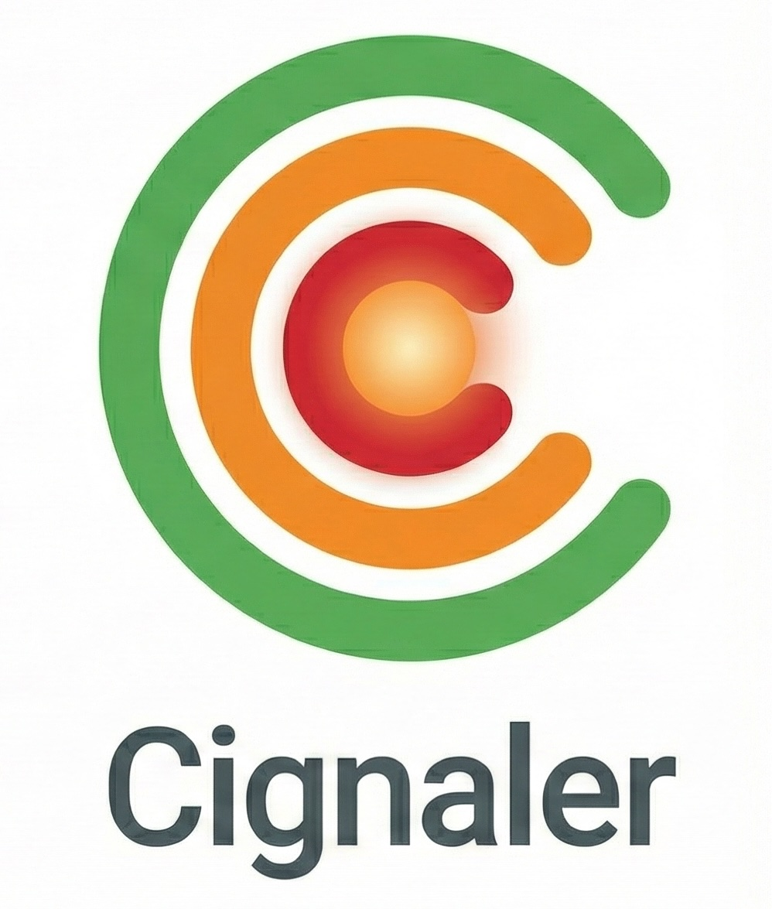

<p align="center">
  
</p>

<h1 align="center">Cignaler</h1>

<p align="center">
  <em>Your CI pipelines, watched. Your focus, protected.</em>
</p>

<p align="center">
  <a href="https://cignaler.github.io">Website</a> ·
  <a href="#getting-started">Getting Started</a> ·
  <a href="#development">Development</a>
</p>

---

Cignaler is a free, open-source desktop app that monitors your GitLab CI/CD pipelines from the system tray. It polls your projects in the background and gives you an at-a-glance status icon — so you stop context-switching to check dashboards and get back to building.

## Features

- **System tray monitoring** — a persistent tray icon shows your overall pipeline health (success, pending, or failed) at a glance
- **Pipeline watchers** — add watchers for any GitLab project and branch you care about
- **Auto-polling** — pipelines refresh automatically every 60 seconds, no manual action needed
- **Manual refresh** — trigger an on-demand refresh any time from the UI
- **Chrome extension** — add watchers directly from your browser while viewing a project on GitLab
- **Multi-server support** — connect to multiple GitLab instances simultaneously
- **Local-only storage** — all data is stored in a local SQLite database; nothing leaves your machine

## Platform Support

| Platform | Status       |
|----------|-------------|
| macOS    | Available   |
| Windows  | Coming soon |
| Linux    | Coming soon |

## CI Provider Support

| Provider        | Status       |
|-----------------|-------------|
| GitLab CI/CD    | Supported   |
| GitHub Actions  | Coming soon |
| Jenkins         | Coming soon |

## Getting Started

1. Download the latest release for macOS from the [releases page](https://github.com/ostwi/cignaler/releases).
2. Open Cignaler — it will appear in your system tray.
3. Open **Preferences** and add your GitLab server URL and API token.
4. Create a **watcher** for any project and branch you want to monitor.

Cignaler will start polling immediately and update the tray icon as builds succeed, run, or fail.

## Chrome Extension

Install the Cignaler Chrome extension to add watchers directly from GitLab pages in your browser — no need to copy-paste project paths manually.

## Privacy

All data stays on your machine. Cignaler stores configuration and pipeline results in a local SQLite database and collects zero telemetry or analytics.

## Development

### Prerequisites

- [Node.js](https://nodejs.org/) (v20+)
- [Rust](https://rustup.rs/) toolchain
- [Tauri CLI prerequisites](https://v2.tauri.app/start/prerequisites/) for your platform

### Setup

```bash
# Clone the repository
git clone https://github.com/ostwi/cignaler.git
cd cignaler

# Install frontend dependencies
npm install

# Start the app in development mode (hot reload)
npm run tauri -- dev
```

### Other Commands

```bash
# Run frontend tests
npm run test:run

# Type-check Svelte components
npm run check

# Build a production binary
npm run tauri -- build
```

The development server runs on `http://localhost:1420`. The Tauri window connects to it automatically in dev mode.

## Tech Stack

- **Frontend:** Svelte 5, TypeScript, Tailwind CSS, Vite
- **Backend:** Rust, Tauri 2, SQLite (via rusqlite)
- **GitLab API:** `gitlab` Rust crate with async polling via Tokio

## License

MIT — see [LICENSE](LICENSE).
